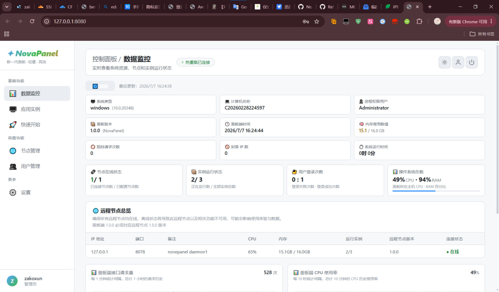
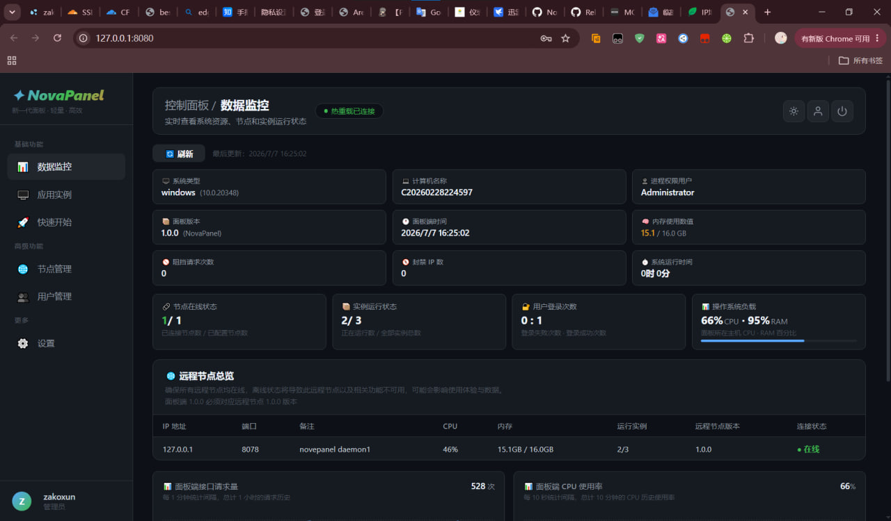

<p align="center">

</p>

<p align="center">

</p>


<h1 align="center">NovaPanel</h1>

<p align="center">
<strong>全 Go 栈 · 零依赖部署 · 为 Minecraft 和控制台应用而生</strong>
</p>

<p align="center">
<a href="#"></a>
<a href="https://golang.org/"></a>
<a href="https://nodejs.org/"></a>
</p>

<blockquote>
<details>
<summary><strong>开始之前请看这里</strong></summary>
<br>

- 本项目当前处于 <strong>Alpha</strong> 阶段，功能仍在持续开发中，部分特性尚不完善
- 预览和开发环境请使用 <code>dev.bat</code> 启动
- <code>run.bat</code> 可用于日常运行，但现阶段不建议依赖它用于生产环境
- 最后更新：<strong>2026 年 7 月 9 日</strong>

<br>
如果遇到任何问题或有好想法，欢迎提 <a href="../../issues">Issue</a>，每一条反馈都有用！ </details>
</blockquote>

关于 NovaPanel
NovaPanel 是一款由 0721xun 开发的轻量级服务器管理面板，最初灵感来自 MCSManager，但在架构上走上了完全不同的路。

它的目标很直接：让服务器管理这件事变得尽可能简单。无论你是要管理 Minecraft 服务器集群，还是需要统一管控各种控制台程序，NovaPanel 都希望做到下载、启动、上手，中间不需要任何多余的步骤。

与大多数面板不同的是，NovaPanel 的前端和后端全部使用 Go 构建，从 Web 服务到页面渲染再到远程节点通信，整条链路由同一门语言贯穿。这个决定带来了几个显著的优势：单二进制分发成为可能，部署复杂度大幅降低，同时 Go 天然的高并发和低资源占用特性也让面板本身的运行开销小到可以忽略不计。

功能一览
核心能力
全 Go 技术栈 —— 前后端统一语言，编译即部署，不再为依赖头疼
内置 Node.js —— 部分 API 服务需要 Node.js 运行时，已随项目打包，无需额外安装
分布式节点管理 —— 支持连接多台远程机器，一个面板控制所有节点
Minecraft 深度适配 —— 针对 MC 服务器的启动、监控和管理做了专门优化
跨平台运行 —— Windows 和 Linux 均可部署
MCSManager 节点兼容 —— 远程节点同时支持 NovaPanel 与 MCSManager 协议，无缝迁移
热重载开发 —— 开发阶段修改代码后自动生效，无需手动重启
实时系统监控 —— CPU、内存、磁盘状态实时刷新，掌握每台机器的健康状况
账号密码认证 —— 基础但有效的安全机制，防止面板被未授权访问

### 下载与启动

```bash
# 克隆项目
git clone https://github.com/你的用户名/NovaPanel.git
cd NovaPanel

# 预览请直接启动（Node.js 已内置）
dev.bat

# 正常使用请直接启动（Node.js 已内置）
run.bat